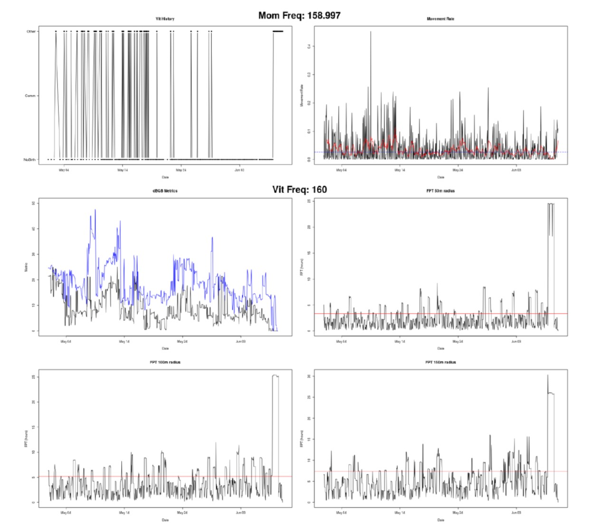
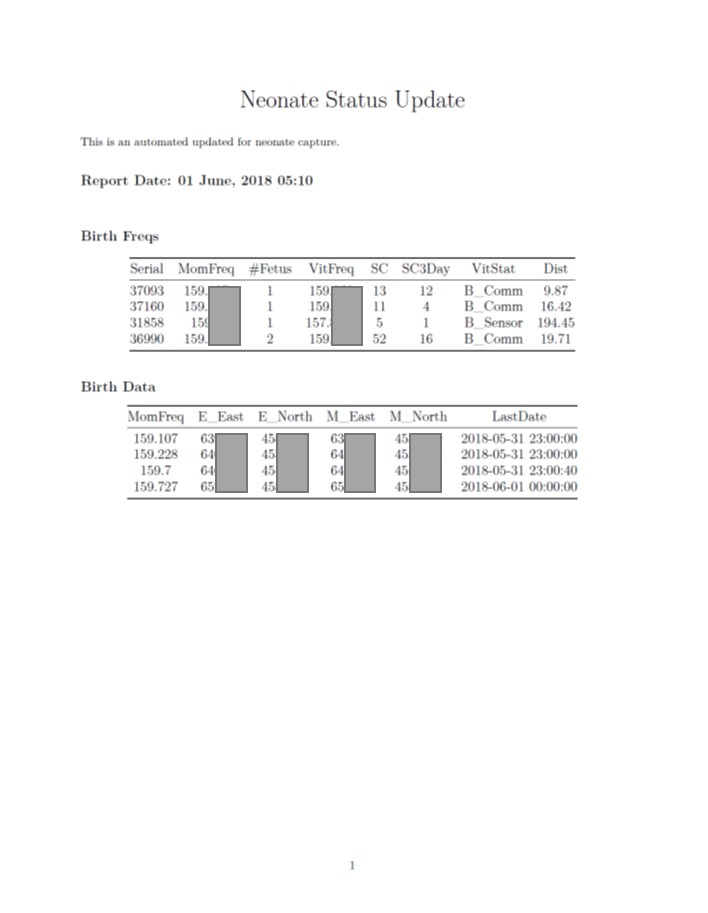
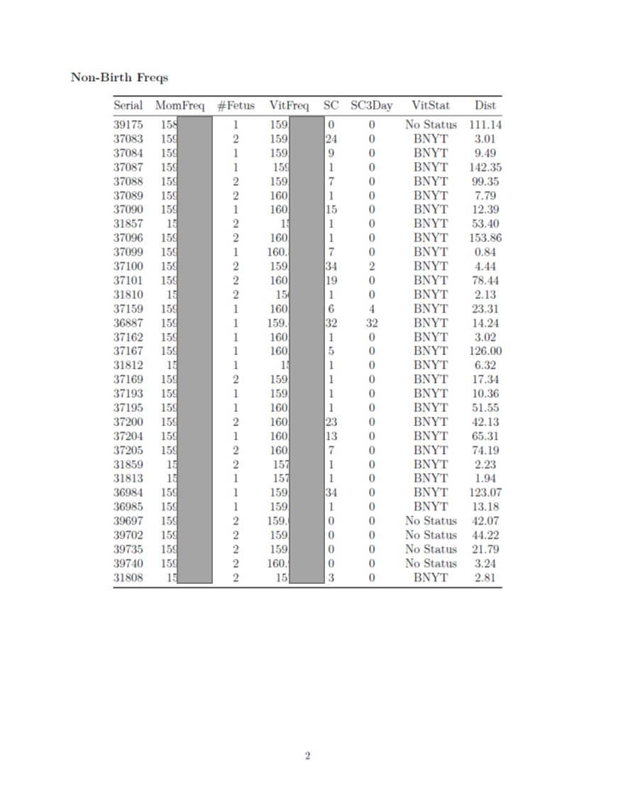

# Part 

## Overview

Part is a suite of tools to aid in modeling and predicting ungulate parturition both in real time
and on historic or previously collected datasets.

## General Thoughts

There are a number of ways to use Part. Are you trying to use code to replace Vaginal Implant Transmitters (VITs)? Are you trying to look back at past movement datasets to determine if you can identify parturition. Do you have a new species which we could add to the growing list of base species models?

Part is best used in collaboration across those of us working on ungulate parturition questions. Many species have evolved life-history strategies around their parturition behavior, mule deer, for instance, give birth and then hide their young who've adapted to remain motionless for some time. Elk typically split off from a herd, give birth in seclusion, leave a young calf in a central spot and forage out from that location, often returning to feed their youngster. We can exploit this knowledge and predict when and animal will give birth based on movement data and, potentially, avoid expensive and costly endeavors to track parturition timing in other ways.

This "life-history strategy" is why/how Part works. Part searches out species-specific patterns in movement data, coupled with the user defining the actual timing of an event. In this way, we have known dates that parturition occurred and can look at the associated movement data. Part is nice in that it ONLY uses movement data; by not using secondary data such as habitat or landcover data, Part is able to generalize for each species across wide geographic ranges. A moose does what a moose does whether that moose is in Alaska, Michigan or Wyoming.

## Installation and Dependencies

### Installation of Part
Currently, the only version of part is on GitHub:

To install:

```{r}
install.packages("devtools")

devtools::install_github("MovingUngulates/Part")
```

You may not have all the packages installed. If you do not, there will be a list of packages that are missing. Install the missing packages and re-install Part with the above code.

### Installing Dependencies
You also need tools to build markdown files and manipulate PDFs. This is done via miktex and PDFtk

#### pdftk
If you use UNIX-like systems:

```{unix}
apt-get install pdftk
```

On Windows:
https://www.pdflabs.com/tools/pdftk-the-pdf-toolkit/


#### miktex
For Miktex see: https://miktex.org/download
NOTE: Windows Users must go to the Other Downloads and use the Net Installer!

As of version 0.4, emailing from Unix-like systems is not working. Need to set email='no' and email another way. as of V0.4

#### sendEmail
To use the automated reports, you need to install sendEmail. This is a lightweight command line program that is used to email the reports to users. 

Get the program zip file from here: http://caspian.dotconf.net/menu/Software/SendEmail/sendEmail-v156.zip

Simply extract that to wherever you please. This location becomes the progpath when using FawnMark or CalfMark.


## Real-Time Predictions

Usage is fairly simple and is boiled down to a single function which downloads all your movement data, does all the manipulations, creates all the plots, creates all the pages of the report, merges all the report pages together and then, finally, emails you the results.

Lookup Table: You need a lookup table with a few columns of data. To see an example:

```{r}

exampLookUp<-data("ExampleLookup",package='Part')

```


Usage:

```{r}

#vecpath path to vectronic data folder
#ATSUsers character vector of ATS user names
#ATSPass character vector of ATS passwords
#tempdir temporary folder for downloading data
#spp Species of animal
#ncpu number of CPU cores for multithreaded work
#lookup path to lookup table
#mortvec character vector of mortalities 
CalfMark(    ATSUser=c('ATSLogin'),
             ATSPass=c('ATSPassword'),
             tempdir='C:/Users/mhayes1/Desktop/ElkFFS/',
             ncpu=6, #depends on threads on your machine
             lookup='F:/Box Sync/DEER/Summer Field Work/PregData.csv',
             mortvec=c(''),
             from='mhayes1@uwyo.edu',
             to=c('mhayes1@uwyo.edu','khuggler@uwyo.edu'),
             subject='Test Calf Mark',
             SP="smtp.office365.com:587",
             progpath='C:/Users/mhayes1/sendEmail/sendEmail.exe',
             username='email',
             password='password',
             email='yes')

```

### Interpreting Real-Time Outputs





This shows several different plots to help detect parturition in real-time. 

 - Top Left: Vit Status
 - Top Right: Movement Rate
 - Middle Left: dynamic bivariate gaussian bridge metrics
 - Middle Right: First Passage Time 50m radius
 - Bottom Left: First Passage Time 100m radius
 - Bottom Right: First Passage Time 150m radius
 

The real-time output from Part contains the above figure for each animal. In addition, the first pages of the FawnMark/CalfMark show an updated status for every animal in your lookup table. This includes their VIT status, location and last fix time stamp.



- - -

Column Description:

 - Serial: Collar Serial Number
 - MomFreq: VHF Frequency for adult female collar
 - #Fetus: Number of fetuses determined when VIT implanted
 - VitFreq: Frequency of VIT
 - SC: Total number of status changes (into/out of birth mode) for VIT
 - SC3Day: Number of status changes for VIT over past 3 days
 - VitStat: Current Vit Status (B_Comm if birth by communication, B_Sensor if birth by temp sensor, No Status for a missing status and BNYT for birth not yet triggered)
 - Dist: distance between mom and location where last vit status change occurred
 - E_East: Easting of the vit status event
 - E_North: Northing of the vit status event
 - M_East: Easting of mothers current location
 - M_Northing: Northing of mothers current location
 - LastDate: Time/Date of last fix for mother




### How to use real-time predictions

The real-time predictions were designed for those that are in the field attempting to capture and collar neonates. The code is setup to run back in your office and scheduled to run at regular intervals (either with cron on UNIX-like systems or Task Scheduler on windows). This setup allows the user in the field to get updates via email at regularly intervals. This eliminates the need to look at data manually or try and sift through tens/hundreds of animals. In addition, the most recent locations for adults in the lookup table are sent along as a kml and gpx file to ease planning and working across teams that could be distributed geographically.

The user would get the setup functional prior to field season and set the entire process running a few weeks prior to ensure no issues arise. Then, the report is automatically run and sent to users in remote locations to help facilitate capturing/monitoring of neonates and parturition.

This _should_ allow more efficient field operations and increased success in capturing collared neonates.
- - -

- - -


## Historic Model Building/Predictions

Many times, we are working with "historic" GPS datasets. In this context, historic simply means already collected. Many of these datasets were not collected with an eye towards neonate captures or determine parturition locations. What if we could leverage GPS datasets to glean a better understanding for where parturition occurs in big critters spatially/temporally?

The thrust of this effort was to use machine learning/data science to build accurate predictive models of ungulate parturition using ONLY x-coordinates, y-coordinates and timestamps. The idea here is that species have evolved life history characteristics that are common amongst that species. Mule deer, for instance, give birth to relatively immobile young. Those young hide (hider strategy) in a central spot and mom wanders off to forage but returns to a central location. Prior to parturition, mom is wandering like a normal deer and then has to abruptly change her behavior to give birth and accomodate that neonate. We could walk through the same process for other animals (including human females). By ignoring habitat we are able to generalize and key in on the movement and life-history characterististics to create a very generalizable approach.

Models are initially built using a dataset with GPS data and known birth dates from VIT data. The crux of all of this work is that you MUST have at least one dataset to create that baseline model to predict to new data.

It would be ideal to get everyone on-board that has these datasets and create large models which others can use to generalize to their non-VIT datasets.

## To Create historic models and validate internally:

```{r}

time.zone = 'Etc/GMT-7'
proj = '+proj=utm +zone=12 +ellps=GRS80 +datum=NAD83 +units=m +no_defs'

parts<-Part::Part_Wrap(dat=dat,
                       projstring=proj,
                       time.zone=time.zone,
                       dataset="AKMoose",
                       ncpus=75,
                       folder='/home/puma/Desktop/RunningPart/Results/AKMoose',
                       mean_date=148,
                       bday_dat=bday_dat,
                       sampsize=80,
                       finBoots=100)
```
Things are fairly simple here.

- dat = GPS data as a data.frame
  - Columns are:
    - UAID - character of unique animal id_year ('201_2016'; this is animal ID 201 for 2016)
    - TelemDate - POSIXct time/date field
    - x - x coordinate (numeric)
    - y - y coordinate (numeric)
  
- proj = projection of your data (MUST be a UTM/meter projection)
- time.zone = time.zone for the TelemDate column in the format above (eg. 'Etc/GMT-7' for mountain time)
- dataset = a name for your dataset. Files will be created with this name attached
- ncpus = how many cpus for parallel functions
- folder = the folder you'd like to save everything in. WILL BE DELETED EACH TIME YOU RUN THE FUNCTION
- mean_date = the average Julian day of parturition in your dataset (the data is clipped +- around this to cut down on data)
- bday_dat = data.frame with two columns
    - Columns are:
      - UAID - character of unique animal id_year ('201_2016'; this is animal ID 201 for 2016)
      - Date.of.Birth - POSIXct formatted date of parturition
- sampsize = what proportion of animals to use in each bootstrap (eg. 80 = 80%)
- finBoots = how many bootstraps to conduct

### Model outputs and internal validation

The output of Part_Wrap is a list. The first element ([[1]]) is a data.frame showing each animal and some statistics about the model fit for that animal. You can use different metrics to determine the day of year; for all of the building process, we used the Mean predicted day. If you'd like to see a simple plot:

```{r}
hist(parts[[1]]$MeanDif)
summary(parts[[1]]$MeanDif)
```
The difference is calculated as Actual Day of Parturition - Predicted Day of Parturition. This histogram will show you how well the model works


## To predict to new data from historic models and/or validate externally:
```{r}
preds<-Part::Part_PredWrap(rfmod = readRDS('/home/puma/Desktop/RunningPart/Results/DEERElk/Results/RFModsForPredict_20180926.RDS'),
                           dat = dat,
                           mean_date = 148,
                           projstring = proj,
                           dataset = 'Starkey_Elk',
                           time.zone = time.zone,
                           ncpus = 80,
                           folder = '/home/puma/Desktop/RunningPart',
                           imp=FALSE)
```

Things are fairly simple here.

- rfmod = the previously saved RFModsForPredict that you got from building models originally
- dat = New GPS data as a data.frame
  - Columns are:
    - UAID - character of unique animal id_year ('201_2016'; this is animal ID 201 for 2016)
    - TelemDate - POSIXct time/date field
    - x - x coordinate (numeric)
    - y - y coordinate (numeric)
  
- mean_date = the average Julian day of parturition in your dataset (the data is clipped +- around this to cut down on data)
- proj = projection of your data (MUST be a UTM/meter projection)
- dataset = a name for your dataset. Files will be created with this name attached
- time.zone = time.zone for the TelemDate column in the format above (eg. 'Etc/GMT-7' for mountain time)
- ncpus = how many cpus for parallel functions
- folder = the folder you'd like to save everything in. WILL BE DELETED EACH TIME YOU RUN THE FUNCTION
- imp = TRUE or FALSE for if missing data should be imputed using missForest. Should only be set to true if models do not predict as expected.