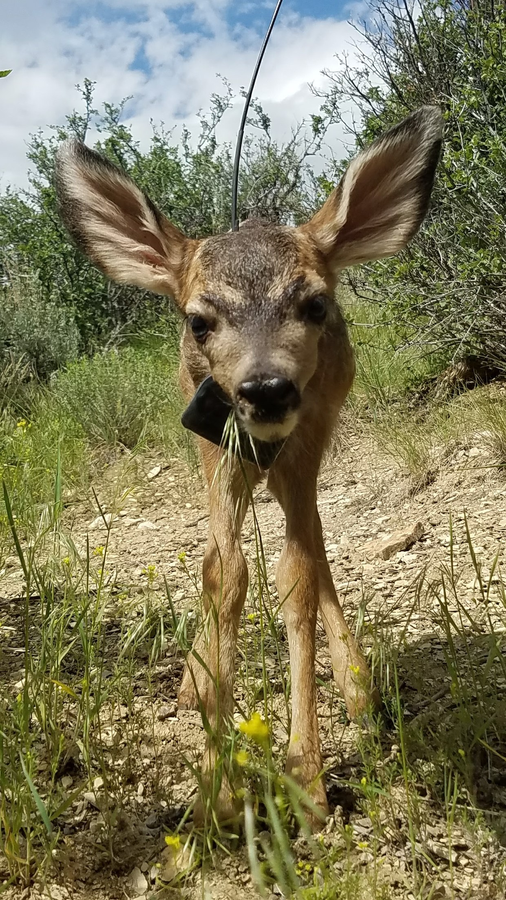

# Part 

## Overview

Part is a suite of tools to aid in modeling and predicting ungulate parturition both in real time
and on historic or previously collected datasets.

## Installation

### Currently, the only version of part is on GitHub:

To install:

```{r}
install.packages("devtools")

devtools::install_github("MovingUngulates/Part")
```

To uninstall current version and get newest version:

```{r}
remove.packages("Part", lib="~/R/win-library/3.4")

devtools::install_github('MovingUngulate/Part')
```

You also need tools to build markdown files and manipulate pdfs. This is done via miktex and PDFtk

sudo apt-get install pdftk
https://www.pdflabs.com/tools/pdftk-the-pdf-toolkit/


## General Thoughts

There are a number of ways to use Part. Are you trying to use code to replace Vaginal Implant Transmitters (VITs)? Are you trying to look back at past movement datasets to determine if you can identify parturition. Do you have a new species which we could add to the growing list of base species models?

Part is best used in collaboration across those of us working on ungulate parturition questions. Many species have evolved life-history strategies around their parturition behavior, mule deer, for instance, give birth and then hide their young who've adapted to remain motionless for some time. Elk typically split off from a herd, give birth in seclusion, leave a young calf in a central spot and forage out from that location, often returning to feed their youngster. We can exploit this knowledge and predict when and animal will give birth based on movement data and, potentially, avoid expensive and costly endeavors to track parturition timing in other ways.

## Usage

To use the automated reports, you need to install sendEmail. This is a lightweight command line program that is used to email the reports to users. 

Get the program zip file from here: http://caspian.dotconf.net/menu/Software/SendEmail/sendEmail-v156.zip

Simply extract that to wherever you please. Then, this become the progpath in your call to FawnMark or CalfMark.

Usage is fairly simple and is boiled down to a single function which downloads all your movement data, does all the manipulations, creates all the plots, creates all the pages of the report, merges all the report pages together and then, finally, emails you the results.

Lookup Table: You need a lookup table with a few columns of data. To see an example:

```{r}

exampLookUp<-data("ExampleLookup",package='Part')

```


Usage:

```{r}

#vecpath path to vectronic data folder
#ATSUsers character vector of ATS user names
#ATSPass character vector of ATS passwords
#tempdir temporary folder for downloading data
#spp Species of animal
#ncpu number of CPU cores for multithreaded work
#lookup path to lookup table
#mortvec character vector of mortalities 
CalfMark(    ATSUser=c('ATSLogin'),
             ATSPass=c('ATSPassword'),
             tempdir='C:/Users/mhayes1/Desktop/ElkFFS/',
             ncpu=6, #depends on threads on your machine
             lookup='F:/Box Sync/DEER/Summer Field Work/PregData.csv',
             mortvec=c(''),
             from='mhayes1@uwyo.edu',
             to=c('mhayes1@uwyo.edu','khuggler@uwyo.edu'),
             subject='Test Calf Mark',
             SP="smtp.office365.com:587",
             progpath='C:/Users/mhayes1/sendEmail/sendEmail.exe',
             username='email',
             password='password',
             email='yes')

```
